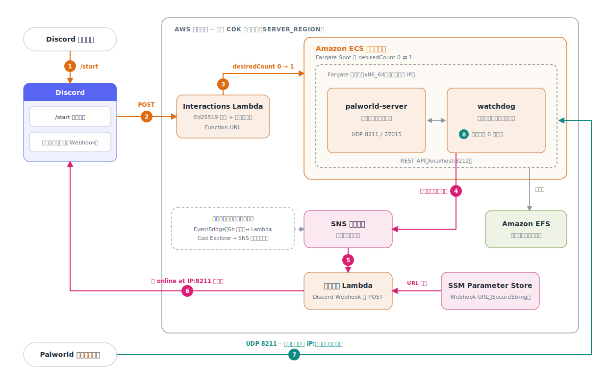
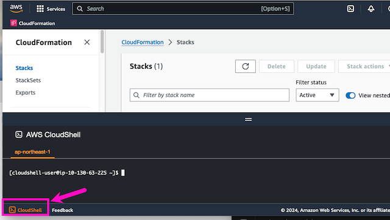

<div align="center">
  <a href="https://github.com/coni524/palworld-ondemand/stargazers"></a>
<a href="https://github.com/coni524/palworld-ondemand/network/members"></a>
<a href="https://github.com/coni524/palworld-ondemand/pulls"></a>
<a href="https://github.com/coni524/palworld-ondemand/issues"></a>
<a href="https://github.com/coni524/palworld-ondemand/graphs/contributors"></a>
<a href="https://github.com/coni524/palworld-ondemand/blob/master/LICENSE"></a>
</div>

# palworld-ondemand

AWS 上で必要なときだけ動く、オンデマンドの Palworld 専用サーバーです。

Discord で `/start` を実行すると、サーバーが ECS Fargate Spot（AWS の空きキャパシティを通常より安価に利用できる購入オプション）で起動し、数分後に接続先アドレス（IP:ポート番号）が Discord のチャンネルへ通知されます。
プレイヤーがいなくなると watchdog（監視用のサイドカーコンテナ）がサーバーを自動停止するため、コンピューティング料金はプレイ中の時間にしかかかりません。
独自ドメインは不要です。

[English version](./README.md)

## 構成図



## クイックスタート

必要なものは、AWS アカウント、パルワールドのクライアント、管理権限を持つ Discord サーバー（ギルド）の 3 つです。
以下の手順はすべて AWS CloudShell（ブラウザから使える AWS のシェル環境）上で完結するため、ローカル環境へのツールのインストールは不要です。

設定項目の一覧（CPU・メモリのサイズ変更、既存 VPC の利用、料金レポート、デバッグログ）とトラブルシューティングは [cdk/README.md](./cdk/README.md) を参照してください。

### 1. Discord アプリケーションの作成

起動コマンドと通知の受け口として、Discord アプリケーションを作成します。

1. [Discord Developer Portal] の「New Application」からアプリケーションを作成します。
2. 「General Information」画面の **Application ID** と **Public Key**（署名検証用の公開鍵）を控えます。
3. 「Bot」画面でボットを追加し、**Bot Token**（ボットの認証トークン）を控えます。トークンは後述のコマンド登録スクリプトでのみ使用し、AWS には保存しません。
4. 「Installation」画面のインストールリンクを使い、アプリケーションを自分の Discord サーバーへ追加します。スコープに `applications.commands` が必要です。
5. Discord クライアントの「設定 → 詳細設定 → 開発者モード」を有効にし、サーバー名を右クリックして **サーバー ID**（ギルド ID）をコピーします。
6. 通知を受け取るチャンネルの「連携サービス → ウェブフック」で Webhook（チャンネルへの投稿用 URL）を作成し、**Webhook URL** を控えます。

### 2. コンフィグの設定とデプロイ



AWS CloudShell でリポジトリをクローンし、必須の 5 項目を設定します。

```
git clone https://github.com/coni524/palworld-ondemand.git
cd palworld-ondemand/cdk/
cp -p .env.sample .env
vi .env
```

```
# Required
DISCORD_PUBLIC_KEY            = 3717e9b6247e0a5e9db9e0e70d842c3a...
DISCORD_GUILD_ID              = 1234567890123456789
ADMIN_PASSWORD                = worldofpaladmin
SERVER_PASSWORD               = worldofpal
SERVER_REGION                 = ap-northeast-1
```

控えておいた Webhook URL を、SERVER_REGION と同じリージョンの SSM Parameter Store（AWS の設定値保管サービス）へ登録します。
CloudFormation（AWS のリソースをテンプレートから作成するサービス）は SecureString（暗号化された文字列パラメータ）を作成できないため、この 1 件だけ手動で登録します。

```
aws ssm put-parameter --region ap-northeast-1 \
  --name /palworld/discord/webhook-url --type SecureString \
  --value 'https://discord.com/api/webhooks/...'
```

pnpm（Node.js のパッケージマネージャー）を Corepack（Node.js に同梱される pnpm/yarn の管理ツール）経由で用意し、デプロイします。
AWS CloudShell には互換性のある pnpm が含まれないため、nvm（Node.js のバージョン管理ツール）で Node.js 22 を導入し、このリポジトリが固定している pnpm のバージョンを Corepack に用意させます。
nvm と Node.js はホームディレクトリ配下に入るため、CloudShell のセッションをまたいでも残ります。

```
# nvm と Node.js 22 を導入する（Corepack は Node.js に同梱。固定した pnpm のバージョンは cdk/package.json から読む）
curl -o- https://raw.githubusercontent.com/nvm-sh/nvm/v0.40.5/install.sh | bash
export NVM_DIR="$HOME/.nvm"
[ -s "$NVM_DIR/nvm.sh" ] && \. "$NVM_DIR/nvm.sh"
nvm install 22
nvm alias default 22
corepack enable
```

```
pnpm install
pnpm run build && pnpm run deploy
```

Corepack が pnpm のダウンロード可否を尋ねたら `Y` で進めます。
CloudShell に接続し直すとシェルが初期化されるため、pnpm を使う前に nvm を読み込み直します（nvm のインストーラーがこの記述を `~/.bashrc` にも追記します）。

```
export NVM_DIR="$HOME/.nvm"
[ -s "$NVM_DIR/nvm.sh" ] && \. "$NVM_DIR/nvm.sh"
```

デプロイ完了時に `palworld-server-stack` が出力する **DiscordInteractionsEndpointUrl** の値（Lambda Function URL、Lambda に直接付与できる HTTPS エンドポイント）を控えます。

### 3. Discord との接続

1. [Discord Developer Portal] の「General Information」画面で、**Interactions Endpoint URL** に控えた URL を設定して保存します。保存時に Discord が検証リクエストを送るため、デプロイ完了後に設定してください。
2. スラッシュコマンドを登録します。

```
DISCORD_APP_ID=<Application ID> \
DISCORD_BOT_TOKEN=<Bot Token> \
DISCORD_GUILD_ID=<サーバー ID> \
./scripts/register_discord_commands.sh
```

### 4. 起動して遊ぶ

Discord のチャンネルで `/start` を実行します。
数分後、Webhook を設定したチャンネルに起動通知が届きます。

```
🟢 palworld-server is online at 203.0.113.10:8211
```

通知のアドレスをパルワールドのサーバーリストに入力し、`SERVER_PASSWORD` で接続します。
IP アドレスは起動のたびに変わるため、毎回最新の通知のアドレスを入力してください。

サーバーは、起動後 10 分間誰も接続しなかった場合、または最後のプレイヤーが抜けてから 20 分後に自動停止します（どちらも変更可能です）。

## コスト

サーバーは常に Fargate Spot（x86_64。Palworld のサーバーバイナリが x86_64 専用のため）で起動し、料金は通常の Fargate より最大 70% 安くなります。
AWS の都合で実行中に中断される可能性はありますが、watchdog が中断通知（SIGTERM）を受け取ってサーバーを安全に停止します。

- 目安: 4 vCPU・16 GB メモリ構成でプレイ 1 時間あたり約 0.29 ドル、月 20 時間の利用で約 5.81 ドルです（[AWS Estimate]）。`.env.sample` の既定値はより小さい 2 vCPU・4 GB 構成です。
- コンピューティング料金はサーバーの稼働中にしか発生しません。停止中に継続してかかるのは、セーブデータを置く EFS（AWS のファイルストレージ）のストレージ料金だけで、少額です。
- `BILLING_ALERT=true` を設定すると、当月の AWS 利用額が定期的に Discord へ通知されます。保険として AWS の請求アラーム（[Billing Alert]）の設定もおすすめします。

## セキュリティ上の注意

- ゲーム用ポート（UDP 8211 と 27015）は、プレイヤーが接続できるようインターネット全体へ開放されます。守りは `SERVER_PASSWORD` だけなので、推測されないパスワードを設定してください。さらに絞りたい場合は、デプロイ後にサービスのセキュリティグループ（AWS の通信許可設定）で接続元 IP アドレスを制限できます。
- `/start` は三層で保護されています。コマンドは自分のサーバーだけに登録され、既定ではサーバー管理者しか実行できず（許可の追加は「サーバー設定 → 連携サービス」）、さらに Lambda が Discord の Ed25519 署名とギルド ID を検証します。Function URL は公開されていますが、Discord 以外からのリクエストはすべて拒否されます。
- 秘密情報をリポジトリに入れないでください。`cdk/.env` にはサーバーのパスワードが入っており、gitignore 済みです（コミットしないでください）。Bot Token はコマンド登録スクリプトで一度使うだけで、AWS には保存されません。Webhook URL は SSM Parameter Store の SecureString にのみ置かれます。
- `ADMIN_PASSWORD` がタスクの外に出ることはありません。管理用の REST API（HTTP ベースの管理用 API）は localhost でのみ待ち受け、そのポートはセキュリティグループでも開放されていません。

## 謝辞

[doctorray117/minecraft-ondemand](https://github.com/doctorray117/minecraft-ondemand) を Palworld 向けに改変したものです。
不具合報告やプルリクエストを歓迎します。

[Discord Developer Portal]: https://discord.com/developers/applications
[aws estimate]: https://calculator.aws/#/estimate?id=ebd1972b24b7d393610389a0017d3e1f8df2ed56
[billing alert]: https://docs.aws.amazon.com/AmazonCloudWatch/latest/monitoring/monitor_estimated_charges_with_cloudwatch.html
