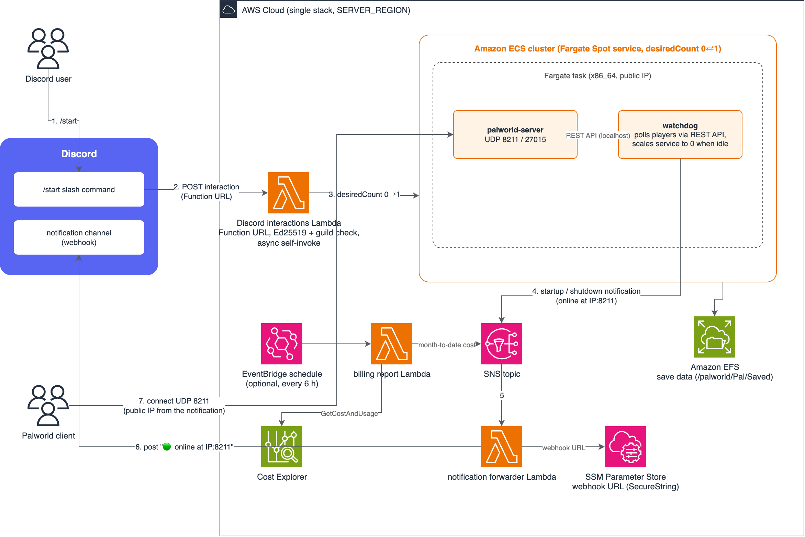

<div align="center">
  <a href="https://github.com/coni524/palworld-ondemand/stargazers"></a>
<a href="https://github.com/coni524/palworld-ondemand/network/members"></a>
<a href="https://github.com/coni524/palworld-ondemand/pulls"></a>
<a href="https://github.com/coni524/palworld-ondemand/issues"></a>
<a href="https://github.com/coni524/palworld-ondemand/graphs/contributors"></a>
<a href="https://github.com/coni524/palworld-ondemand/blob/master/LICENSE"></a>
</div>

# palworld-ondemand

On-demand Palworld dedicated server on AWS.

Run `/start` in Discord and the server comes up on ECS Fargate Spot; a few minutes later its address (`IP:port`) is posted to your Discord channel. When nobody is playing, a watchdog shuts the server down again, so you pay for compute only while playing. No domain name is required.

[日本語版](./README-ja.md)

## Architecture



## Quick Start

You need an AWS account, a Palworld client, and a Discord server (guild) you administer. Everything below runs in AWS CloudShell, so no local tooling is required.

For all configuration options (CPU/memory sizing, existing VPC, billing report, debug logging) and troubleshooting, see [cdk/README.md](./cdk/README.md).

### 1. Create a Discord application

1. Create an application from `New Application` in the [Discord Developer Portal].
2. Note the **Application ID** and the **Public Key** on the `General Information` page.
3. Add a bot on the `Bot` page and note the **Bot Token** (used only by the command-registration script below; it is never stored in AWS).
4. Install the application to your Discord server via the install link on the `Installation` page. The `applications.commands` scope is required.
5. Enable `Settings > Advanced > Developer Mode` in your Discord client, right-click your server name, and copy the **Server ID** (guild ID).
6. Create a webhook under `Integrations > Webhooks` in the channel that should receive notifications and note the **Webhook URL**.

### 2. Configure and deploy


In AWS CloudShell, clone the repository and fill in the required values:

```
git clone https://github.com/coni524/palworld-ondemand.git
cd palworld-ondemand/cdk/
cp -p .env.sample .env
vi .env
```

```
# Required
DISCORD_PUBLIC_KEY            = 3717e9b6247e0a5e9db9e0e70d842c3a...
DISCORD_GUILD_ID              = 1234567890123456789
ADMIN_PASSWORD                = worldofpaladmin
SERVER_PASSWORD               = worldofpal
SERVER_REGION                 = ap-northeast-1
```

Store the webhook URL in SSM Parameter Store in the same region as `SERVER_REGION` (CloudFormation cannot create SecureString parameters, so this single value is registered by hand):

```
aws ssm put-parameter --region ap-northeast-1 \
  --name /palworld/discord/webhook-url --type SecureString \
  --value 'https://discord.com/api/webhooks/...'
```

Install pnpm (skip if already installed), then deploy:

```
curl -fsSL https://get.pnpm.io/install.sh | sh -
source ~/.bashrc

pnpm install
pnpm run build && pnpm run deploy
```

When the deploy finishes, note the **DiscordInteractionsEndpointUrl** value that `palworld-server-stack` outputs.

### 3. Connect Discord

1. On the `General Information` page of the [Discord Developer Portal], set **Interactions Endpoint URL** to the URL from the deploy output and save. Discord sends a verification request on save, so do this after the deploy has finished.
2. Register the slash command:

```
DISCORD_APP_ID=<Application ID> \
DISCORD_BOT_TOKEN=<Bot Token> \
DISCORD_GUILD_ID=<Server ID> \
./scripts/register_discord_commands.sh
```

### 4. Play

Run `/start` in your Discord server. After a few minutes the webhook channel receives the startup notification:

```
🟢 palworld-server is online at 203.0.113.10:8211
```

Add the address to the Palworld server list and connect with `SERVER_PASSWORD`. The IP address changes on every launch, so use the one from the latest notification.

The server stops itself after 10 minutes without a first connection, or 20 minutes after the last player leaves (both configurable).

## Cost

The server always runs on Fargate Spot (x86_64; the Palworld binary is x86_64-only), which is up to 70% cheaper than regular Fargate. AWS can reclaim Spot capacity at any time, but the watchdog traps the termination signal and shuts the server down safely.

- Rough guide: $0.29 per hour of play with a 4 vCPU / 16 GB memory task — about $5.81 for 20 hours a month ([AWS Estimate]). The `.env.sample` default is a smaller 2 vCPU / 4 GB task.
- Compute is billed only while the server is running. While stopped, the only recurring charge is EFS storage for the save data, which is small.
- Set `BILLING_ALERT=true` to have the month-to-date AWS cost posted to Discord periodically, and consider an AWS [Billing Alert] as a backstop.

## Security notes

- The game ports (UDP 8211 and 27015) are open to the whole internet so that players can join; `SERVER_PASSWORD` is the only gate, so use one that cannot be guessed. To lock things down further, restrict the source IP ranges on the service security group after deploying.
- `/start` is protected in three layers: the command is registered only in your guild, only server admins can run it by default (grant others under `Server Settings > Integrations`), and the Lambda verifies Discord's Ed25519 request signature plus the guild ID. The Function URL is public, but it rejects everything that does not come from Discord.
- Keep secrets out of the repository: `cdk/.env` holds the server passwords and is gitignored — do not commit it. The Bot Token is used once by the registration script and never stored in AWS. The webhook URL lives only in SSM Parameter Store as a SecureString.
- `ADMIN_PASSWORD` never leaves the task: the management REST API listens on localhost only and its port is not opened in the security group.

## Acknowledgements

Adapted from [doctorray117/minecraft-ondemand](https://github.com/doctorray117/minecraft-ondemand). Issues and pull requests are welcome.

[Discord Developer Portal]: https://discord.com/developers/applications
[aws estimate]: https://calculator.aws/#/estimate?id=ebd1972b24b7d393610389a0017d3e1f8df2ed56
[billing alert]: https://docs.aws.amazon.com/AmazonCloudWatch/latest/monitoring/monitor_estimated_charges_with_cloudwatch.html
